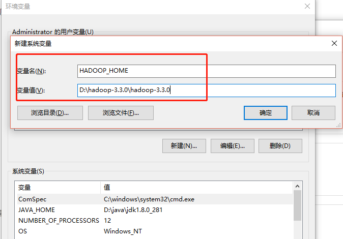
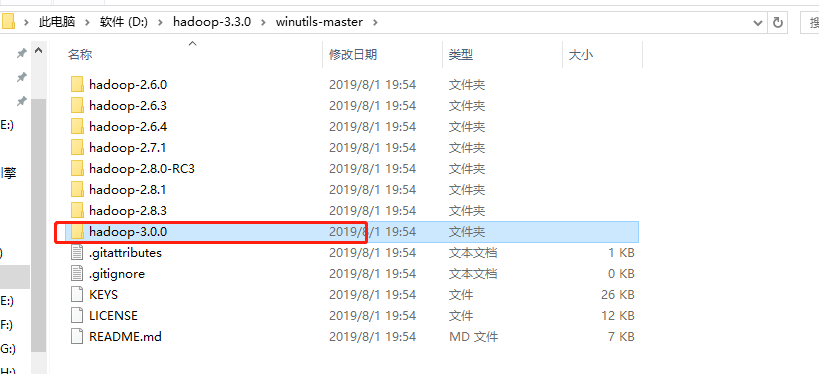
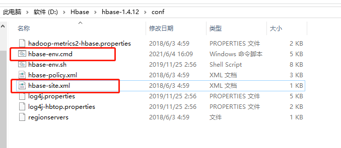
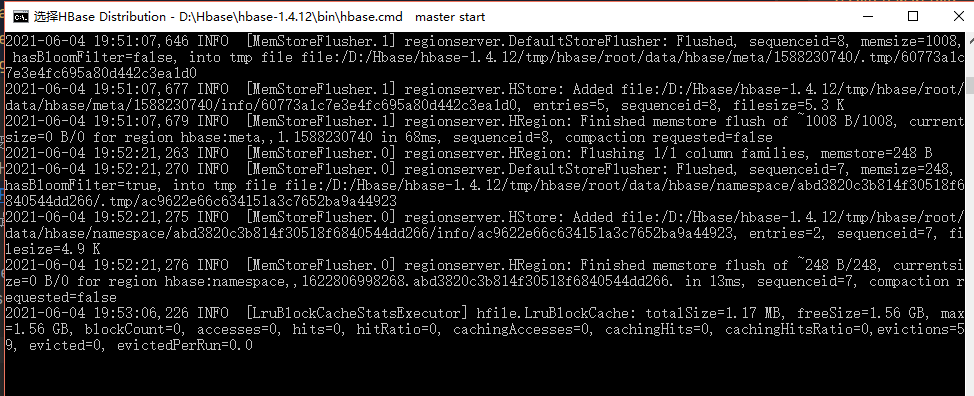
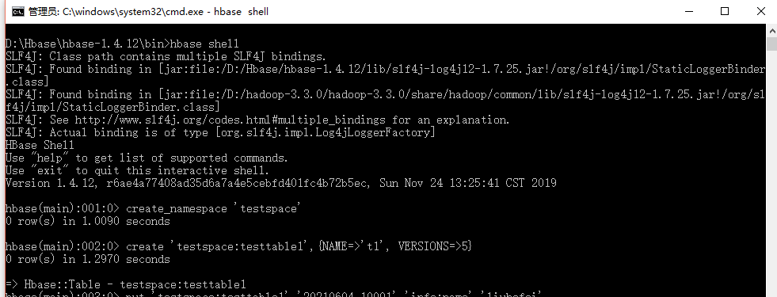

#Springboot整合Hbase

## 环境配置
### 在windows环境下hadoop安装和配置详细步骤
1. 下载hadoop安装包hadoop-3.3.0.tar.gz     
   下载地址： https://apache.claz.org/hadoop/common/hadoop-3.3.0/   
   下载完成后解压，把hadoop-3.3.0放到某个盘的根目录，比如 D:\hadoop-3.3.0。
   原版的Hadoop不支持Windows系统，我们需要修改一些配置方便在Windows上运行，需要从网上搜索下载hadoop对应版本的windows运行包(网上自行下载对应版本的运行包)。
   windows运行包地址：https://github.com/steveloughran/winutils  找到对应的版本进行下载      
   下载完之后复制解压开的bin文件到hadoop-3.3.0文件中，并替换原有的bin文件。
   
2. 配置Hadoop环境变量，如下：
   HADOOP_HOME=D:\hadoop-3.3.0\winutils-master\hadoop-3.0.0
       
   在path中最前面加上：%HADOOP_HOME%\bin;
   
3. 将如下内容粘贴到D:\hadoop-3.3.0\hadoop-3.3.0\etc\hadoop\core-site.xml文件：
```xml
<configuration>
	<property>
       <name>fs.defaultFS</name>
       <value>hdfs://localhost:9000</value>
    </property>
</configuration>
```

4. 将如下内容粘贴到D:\hadoop-3.3.0\hadoop-3.3.0\etc\hadoop\mapred-site.xml文件：
```xml
<configuration>
	<property>
		<name>mapreduce.framework.name</name>
		<value>yarn</value>
	</property>
</configuration>
```

5. 在D:\hadoop-3.3.0\hadoop-3.3.0路径下创建“data”子目录；
在D:\hadoop-3.3.0\hadoop-3.3.0\data路径下创建“namenode”子目录；
在D:\hadoop-3.3.0\hadoop-3.3.0\data路径下创建“datanode”子目录。
   
6. 将如下内容粘贴到D:\hadoop-3.3.0\hadoop-3.3.0\etc\hadoop\hdfs-site.xml文件：
```xml
<configuration>
    <property>
        <name>dfs.replication</name>
        <value>1</value>
    </property>
    <property>
        <name>dfs.namenode.name.dir</name>
        <value>file:///D:/hadoop-3.3.0/hadoop-3.3.0/data/namenode</value>
    </property>
    <property>
        <name>dfs.datanode.data.dir</name>
        <value>file:///D:/hadoop-3.3.0/hadoop-3.3.0/data/datanode</value>
    </property>
</configuration>
```

7. 将如下内容粘贴到D:\hadoop-3.3.0\hadoop-3.3.0\etc\hadoop\yarn-site.xml文件：
```xml
<configuration>
<!-- Site specific YARN configuration properties -->
	<property>
		<name>yarn.nodemanager.aux-services</name>
		<value>mapreduce_shuffle</value>
	</property>
	<property>
		<name>yarn.nodemanager.auxservices.mapreduce.shuffle.class</name> 
		<value>org.apache.hadoop.mapred.ShuffleHandler</value>
	</property>
</configuration>
```

8. 编辑文件D:\hadoop-3.3.0\hadoop-3.3.0\etc\hadoop\hadoop-env.cmd，添加如下语句：
   set JAVA_HOME=D:\java\jdk1.8.0_281

9. 至此，hadoop安装完成，下面去启动验证它
   启动windows cmd窗口，执行命令：hdfs namenode -format , 先对HDFS分布式文件系统进行格式化。
   然后进入目录D:\hadoop-3.3.0\hadoop-3.3.0\sbin，启动运行 start-dfs.cmd, 如果一切正常，将会启动一个“hdfs namenode”进程和一个“hdfs datanode”进程，构成了只有1个主节点和1个从节点的“HDFS分布式文件系统集群”。
   可以通过“http://localhost:9870”监控HDFS系统。运行效果如下：      
   
   HDFS分布式文件系正常启动之后，可以用“hadoop fs”或“hdfs dfs”命令在分布式文件系统中实现“浏览目录”、“创建子目录”、“删除子目录”、“创建文件”、“拷贝文件”、“移动子目录或文件”、“查看文件内容”、“删除文件”、“上传本地文件”等操作。命令如下：       
    hadoop fs –ls / 显示根目录下的所有文件和目录          
    hadoop fs –mkdir /test   创建子目录/test，创建多级目录 加上 –p               
    hadoop fs -rm /test1.txt 删除文件               
    hadoop fs -rm -r /test 删除子目录（要加-r参数）              
    hadoop fs -put C:\tmp\test.txt \test 将本地文件上传到HDFS分布式文件系统         
    hadoop fs -cat \test\test.txt 查看文件内容           
    hadoop fs -cp URI [URI …] <dest>  cp复制系统内文件            
    hadoop fs -get[-ignorecrc] [-crc] <src> <localdst>  下载文件到本地           
    hadoop fs -mv URI [URI …] <dest>  将文件从源路径移动到目标路径            
    hadoop fs -du URI [URI …]   显示文件大小

10. http://localhost:9870工具中在“utilities”菜单下有一个“Browse the File System”工具，可以浏览、操作HDFS分布式文件系统。    

11. 进入“C:\Hadoop\sbin”目录运行命令“stop-dfs”，关闭HDFS分布式文件系统。

可参考：https://blog.csdn.net/Mr_yuntuo/article/details/90728174      
https://blog.csdn.net/weixin_43986204/article/details/90210010       

   

### 在windows环境下安装Hbase
1. 下载Hbase地址：http://archive.apache.org/dist/hbase/   选择所需的版本进行下载     
   我选择最新的版本hbase-1.4.12-bin.tar.gz（http://archive.apache.org/dist/hbase/hbase-1.4.12/）解压缩到D:/Hbase/hbase-1.4.12      
2. 下载Habse所需的Hadoop的windows包（winutils-master），下载地址：https://github.com/steveloughran/winutils  HBase在Windows下部署需要使用到。下载到D盘（D:\hadoop-3.3.0），
   对winutils-master.zip进行解压缩，在这里我选D:\hadoop-3.3.0\winutils-master\hadoop-3.0.0   
   
3. 配置Hbase，Hbase解压缩的目录下，
         
   找到conf/hbase-env.cmd，配置jdk环境，配置如下：             
   set JAVA_HOME=D:\java\jdk1.8.0_281            
   set HBASE_MANAGES_ZK=true
   
4. 修改Hbase下的conf/hbase-site.xml，修改如下：
```xml
   <configuration>
	<property>  
		<name>hbase.rootdir</name>  
		<value>file:///D:/Hbase/hbase-1.4.12/tmp/hbase/root</value>  
	</property>  
	<property>  
		<name>hbase.tmp.dir</name>  
		<value>D:/Hbase/hbase-1.4.12/tmp/hbase/tmp</value>  
	</property>  
	<property>  
		<name>hbase.zookeeper.quorum</name>  
		<value>127.0.0.1</value>  
	</property>  
	<property>  
		<name>hbase.zookeeper.property.dataDir</name>  
		<value>D:/Hbase/hbase-1.4.12/tmp/hbase/zoo</value>  
	</property>  
	<property>  
		<name>hbase.cluster.distributed</name>  
		<value>false</value>  
	</property>
   </configuration>
``` 

5. 配置环境变量HADOOP_HOME         
   HADOOP_HOME=D:\hadoop-3.3.0\winutils-master\hadoop-3.0.0
       
   在path中最前面加上：%HADOOP_HOME%\bin;
   
6. 启动Hbase       
  在D:\Hbase\hbase-1.4.12\bin下打开命令，点击运行start-hbase.cmd，启动Hbase.
   

7. 进入目录D:\Hbase\hbase-1.4.12\bin，利用cmd窗口执行命令：hbase shell, 启动命令窗口   
   
   
参考：https://baijiahao.baidu.com/s?id=1631231582763493960&wfr=spider&for=pc      
https://www.cnblogs.com/sjzxxy/p/13472369.html       

1、创建namespace

create_namespace 'testspace'


2、创建表

create 'testspace:testtable1', {NAME => 'f1', VERSIONS => 5}


（1）testspace指的就是namespace；

（2）testtable1代表table_name；

（3）testspace:testtable1唯一确定了一张表；

（4）在hbase中=>符号表示等于；

（5）f1指的是列簇；

（6）VERSIONS => 5代表同时能够存储的版本数；

（7）建表时要指定一个列簇；

（8）可以指定多个列簇，一个大括号中只能指定一个NAME（变量）；

（9）一个列簇就是一个大括号。

在建表的时候可以指定在某个namespace下，比如：ns1:t1，没有指定就是在默认的数据库下面创建

3、插入数据

put 'testspace:testtable1','20190419_10001','info:name','zhangsan'

put 'testspace:testtable1','20190419_10001','info:age','22'

put 'testspace:testtable1','20190419_10002','info:name','lisi'

put 'testspace:testtable1','20190419_10003','info:name','wangwu'

（1）'20190419_10001' 代表rowkey

（2）'info:name' 代表列+列簇

（3）'zhangsan' 代表具体插入的值

4、查询数据

get 'testspace:testtable1','20190419_10001'

一个rowkey可能有多个列簇，可以指定列簇进行查询。

五、HBase管理页面

Web管理页面为，localhost:16010/master-status
